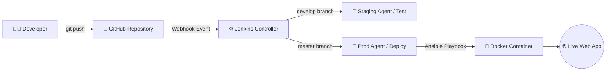
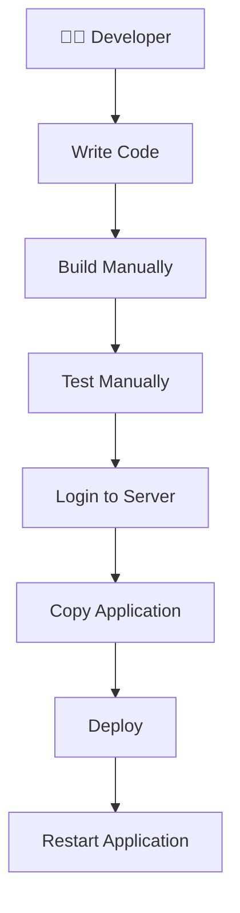
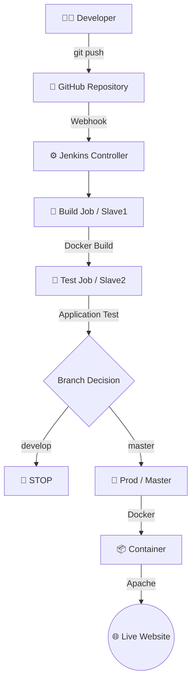
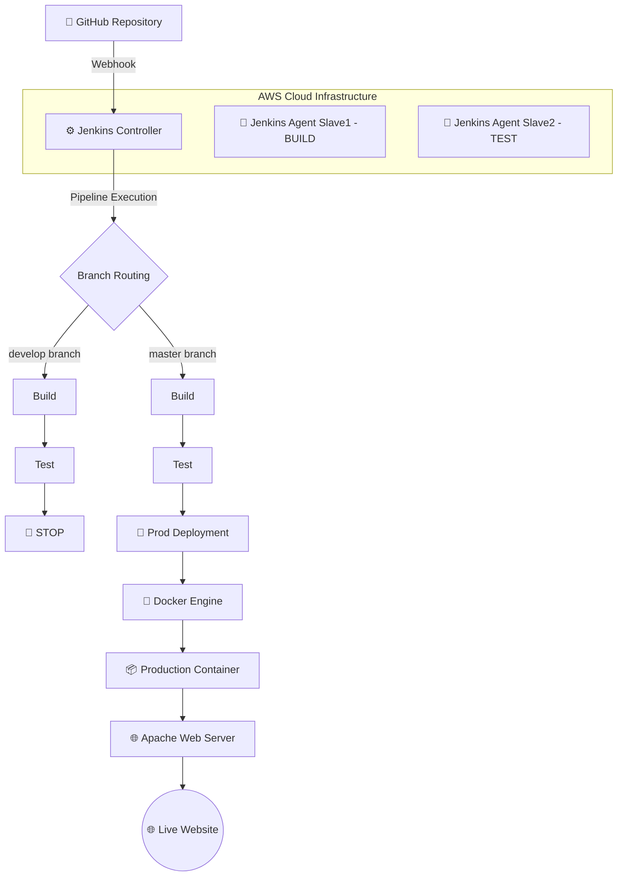
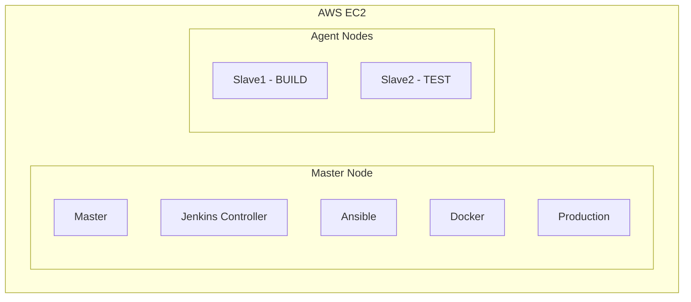
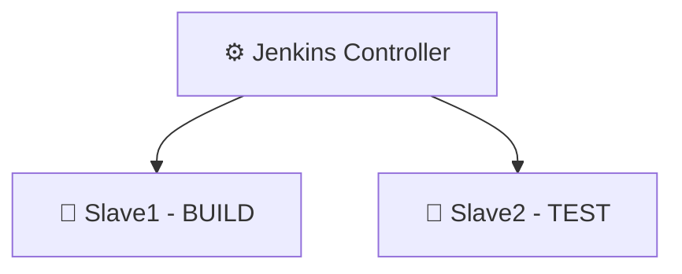

<div align="center">

# 🚀 AWS Jenkins CI/CD Pipeline

### End-to-End DevOps CI/CD Automation using AWS, Ansible, Jenkins, GitHub, GitHub Webhooks and Docker


<br>

**GitHub → Webhook → Jenkins → Build → Test → Production → Docker → Live Website**

<br>

A complete branch-based CI/CD implementation with automated build, testing and production deployment.

</div>

---

# 📑 Table of Contents

- [📖 Project Overview](#-project-overview)
- [❗ Problem Statement](#-problem-statement)
- [🎯 Project Objectives](#-project-objectives)
- [💡 Solution](#-solution)
- [🏗️ Architecture](#️-architecture)
- [🔄 CI/CD Workflow](#-cicd-workflow)
- [🧰 Technology Stack](#-technology-stack)
- [☁️ AWS Infrastructure](#️-aws-infrastructure)
- [🖥️ Server Architecture](#️-server-architecture)
- [📂 Project Structure](#-project-structure)
- [⚙️ Phase 1 - AWS Infrastructure](#️-phase-1---aws-infrastructure)
- [🔐 Phase 2 - Server Configuration](#-phase-2---server-configuration)
- [⚙️ Phase 3 - Ansible Configuration](#️-phase-3---ansible-configuration)
- [🔨 Phase 4 - Jenkins Installation](#-phase-4---jenkins-installation)
- [🖥️ Phase 5 - Jenkins Agents](#-phase-5---jenkins-agents)
- [🐳 Phase 6 - Docker Configuration](#-phase-6---docker-configuration)
- [🐙 Phase 7 - GitHub Configuration](#-phase-7---github-configuration)
- [🔑 Phase 8 - Jenkins Credentials](#-phase-8---jenkins-credentials)
- [🔨 Phase 9 - Build Job](#-phase-9---build-job)
- [🧪 Phase 10 - Test Job](#-phase-10---test-job)
- [🚀 Phase 11 - Production Job](#-phase-11---production-job)
- [🔔 Phase 12 - GitHub Webhook](#-phase-12---github-webhook)
- [🌿 Phase 13 - Branch Strategy](#-phase-13---branch-strategy)
- [🌐 Phase 14 - Website Deployment Demonstration](#-phase-14---website-deployment-demonstration)
- [🐳 Docker Implementation](#-docker-implementation)
- [🔧 Pipeline Scripts](#-pipeline-scripts)
- [🐞 Troubleshooting](#-troubleshooting)
- [🔐 Security](#-security)
- [🧪 Testing and Validation](#-testing-and-validation)
- [📈 Advantages](#-advantages)
- [🚀 Future Enhancements](#-future-enhancements)
- [📚 Learning Outcomes](#-learning-outcomes)
- [🎓 Project Demonstration](#-project-demonstration)
- [✅ Final Checklist](#-final-checklist)
- [👨‍💻 Author](#-author)

---

# 📖 Project Overview

This project implements a complete **DevOps CI/CD lifecycle** for a web application using AWS EC2, Ubuntu Linux, Ansible, Jenkins, GitHub, GitHub Webhooks and Docker.

The application source code is maintained in GitHub. Developers work with two branches:

- `develop`
- `master`

### 🔄 Visual Workflow Diagram



# ❗ Problem Statement

Traditional application deployment often involves manually performing multiple steps:



This manual process can introduce:

* ❌ Human errors
* ❌ Configuration inconsistencies
* ❌ Slow deployment
* ❌ Repetitive manual work
* ❌ Difficult troubleshooting
* ❌ Inconsistent testing
* ❌ Production deployment risks

The objective of this project is to automate the complete process using a CI/CD pipeline.

---

# 🎯 Project Objectives

The project is designed to:

* 🔹 Automate server configuration using Ansible.
* 🔹 Deploy Jenkins on AWS EC2.
* 🔹 Configure Jenkins Controller-Agent architecture.
* 🔹 Integrate Jenkins with GitHub.
* 🔹 Configure GitHub authentication.
* 🔹 Configure GitHub Webhooks.
* 🔹 Implement branch-based CI/CD.
* 🔹 Automatically build Docker images.
* 🔹 Automatically test the application.
* 🔹 Automatically deploy the production version.
* 🔹 Automatically replace the existing production container.
* 🔹 Verify the deployed website.
* 🔹 Demonstrate practical DevOps troubleshooting.

---

# 💡 Solution

The implemented solution follows this architecture:



---

# 🏗️ Architecture

### Complete Project Architecture



---

# 🔄 CI/CD Workflow

### Development Workflow
When code is pushed to `develop`:

```text
git push origin develop ➔ GitHub ➔ Webhook ➔ Jenkins ➔ Build (Slave1) ➔ Docker Build ➔ Test (Slave2) ➔ Application Test ➔ SUCCESS ➔ STOP
```

> **Note:** Production is **not** deployed from the `develop` branch.

### Production Workflow
When code is pushed to `master`:

```text
git push origin master ➔ GitHub ➔ Webhook ➔ Jenkins ➔ Build (Slave1) ➔ Docker Build ➔ Test (Slave2) ➔ Application Test ➔ Prod (Master) ➔ Docker Build ➔ Stop Old Container ➔ Start New Container ➔ Verify Deployment ➔ LIVE WEBSITE
```

---

# 🧰 Technology Stack

| Technology | Purpose |
| :--- | :--- |
| **AWS EC2** | Cloud infrastructure |
| **Ubuntu** | Operating system |
| **Ansible** | Configuration management |
| **Jenkins** | CI/CD automation |
| **GitHub** | Source code management |
| **Git** | Version control |
| **GitHub Webhook** | Automatic pipeline triggering |
| **Docker** | Containerization |
| **Apache** | Web server |
| **SSH** | Server administration |
| **HTML** | Web application |

---

# ☁️ AWS Infrastructure

The project uses multiple Ubuntu EC2 instances.

| Server | Role | Main Responsibility |
| :--- | :--- | :--- |
| **Master** | Jenkins Controller + Production | Jenkins, Docker, Ansible, Production |
| **Slave1** | Jenkins Agent | Build |
| **Slave2** | Jenkins Agent | Test |

---

# 🖥️ Server Architecture



---

# 📂 Project Structure

The application repository contains:

```text
website/
│
├── index.html
├── Dockerfile
├── images/
│   └── github3.jpg
│
└── README.md
```

Jenkins consists of three jobs:

```text
Jenkins
│
├── Build
├── Test
└── Prod
```

Ansible configuration contains:

```text
Ansible
│
├── ansible.cfg
├── hosts
├── ans.yaml
├── master.sh
└── slave.sh
```
# ⚙️ Phase 1 - AWS Infrastructure

### Step 1 - Create EC2 Instances
Create Ubuntu EC2 instances for:
- **Master**
- **Slave1**
- **Slave2**

Assign appropriate security groups to each instance.

### Step 2 - Security Group
Configure inbound rules with the required ports:

| Port | Purpose |
| :--- | :--- |
| **22** | SSH |
| **80** | HTTP |
| **8080** | Jenkins |

> **Note:** For production environments, restrict access to trusted IP addresses.

---

# 🔐 Phase 2 - Server Configuration

1. Connect to Master:
   ```bash
   ssh -i <KEY.pem> ubuntu@<MASTER_PUBLIC_IP>
   ```

2. Check hostname:
   ```bash
   hostname
   ```

3. Check IP address:
   ```bash
   hostname -I
   ```

4. Test network connectivity:
   ```bash
   ping <SLAVE1_PRIVATE_IP>
   ping <SLAVE2_PRIVATE_IP>
   ```

---

# ⚙️ Phase 3 - Ansible Configuration

### 1. Install Ansible
```bash
sudo apt update
sudo apt install ansible -y
```

Verify installation:
```bash
ansible --version
```

### 2. Create Inventory
Edit `/etc/ansible/hosts`:
```bash
sudo nano /etc/ansible/hosts
```

Add your nodes:
```ini
[master]
master ansible_host=<MASTER_PRIVATE_IP>

[slave1]
slave1 ansible_host=<SLAVE1_PRIVATE_IP>

[slave2]
slave2 ansible_host=<SLAVE2_PRIVATE_IP>
```

### 3. Configure Ansible Settings
Edit `/etc/ansible/ansible.cfg`:
```bash
sudo nano /etc/ansible/ansible.cfg
```

Add the following configuration:
```ini
[defaults]
inventory = /etc/ansible/hosts
host_key_checking = False
```

### 4. Test Ansible Connectivity
```bash
ansible all -m ping
```

**Expected Output:**
```text
master | SUCCESS => { "ping": "pong" }
slave1 | SUCCESS => { "ping": "pong" }
slave2 | SUCCESS => { "ping": "pong" }
```

### 5. Run Ansible Playbook

Create `ans.yaml`:
```yaml
---
- name: Configure Master
  hosts: master
  become: true

  tasks:
    - name: Update packages
      apt:
        update_cache: yes

    - name: Install required packages
      apt:
        name:
          - git
          - docker.io
          - openjdk-21-jdk
        state: present

    - name: Start Docker
      service:
        name: docker
        state: started
        enabled: yes

- name: Configure Jenkins Agents
  hosts:
    - slave1
    - slave2
  become: true

  tasks:
    - name: Update packages
      apt:
        update_cache: yes

    - name: Install required packages
      apt:
        name:
          - git
          - docker.io
          - openjdk-21-jdk
        state: present

    - name: Start Docker
      service:
        name: docker
        state: started
        enabled: yes
```

Execute the playbook:
```bash
ansible-playbook ans.yaml
```

---

# 🔨 Phase 4 - Jenkins Installation

1. Install Java dependency:
   ```bash
   sudo apt update
   sudo apt install fontconfig openjdk-21-jdk -y
   ```

2. Verify Java version:
   ```bash
   java -version
   ```

3. Start and enable Jenkins service:
   ```bash
   sudo systemctl start jenkins
   sudo systemctl enable jenkins
   ```

4. Check service status:
   ```bash
   sudo systemctl status jenkins
   ```

5. Access Jenkins Web Console:
   ```text
   http://<MASTER_PUBLIC_IP>:8080
   ```

---

# 🖥️ Phase 5 - Jenkins Agents

Jenkins uses a **Controller-Agent** architecture to distribute workload.



### Node Responsibilities

* **Master (Controller)**
  * Jenkins Controller orchestration
  * Ansible configuration management
  * Docker runtime execution
  * Production deployment target

* **Slave1 (Build Agent)**
  * Git repository checkout
  * Docker image build
  * Build verification
  * Triggers downstream Test job

* **Slave2 (Test Agent)**
  * Git repository checkout
  * Docker image build
  * Automated application testing
  * Triggers Production job (for `master` branch)

---

# 🐳 Phase 6 - Docker Configuration

### 1. Engine Setup
```bash
sudo apt update
sudo apt install docker.io -y
sudo systemctl start docker
sudo systemctl enable docker
docker --version
```

### 2. Configure Permissions for Jenkins
Grant Jenkins permission to communicate with the Docker daemon:
```bash
sudo usermod -aG docker jenkins
sudo systemctl restart jenkins
```

Verify permissions:
```bash
sudo -u jenkins docker ps
```

### 📦 Dockerfile
```dockerfile
FROM hshar/webapp
COPY . /var/www/html
EXPOSE 80
CMD ["sh", "-c", "rm -f /var/run/apache2/apache2.pid && apachectl -D FOREGROUND"]
```

### 🔍 Dockerfile Breakdown

| Directive | Purpose |
| :--- | :--- |
| `FROM hshar/webapp` | Uses the web application base image. |
| `COPY . /var/www/html` | Copies website source code into Apache document root. |
| `EXPOSE 80` | Exposes HTTP web port 80. |
| `CMD [...]` | Removes stale PID files and launches Apache in foreground mode. |

---

# 🐙 Phase 7 - GitHub Configuration

1. Clone the application repository:
   ```bash
   git clone [https://github.com/arpanbiki/website.git](https://github.com/arpanbiki/website.git)
   cd website
   ```

2. Verify remote repository:
   ```bash
   git remote -v
   ```
   *Expected:* `origin https://github.com/arpanbiki/website.git`

### 🌿 Branch Setup
The project uses `develop` and `master` branches:

1. Create and push `develop` branch:
   ```bash
   git checkout -b develop
   git push -u origin develop
   ```

2. Switch back to `master`:
   ```bash
   git checkout master
   ```

---

# 🔑 Phase 8 - Jenkins Credentials

1. Navigate in Jenkins UI:
   ```text
   Dashboard ➔ Manage Jenkins ➔ Credentials ➔ System ➔ Global Credentials
   ```

2. Create GitHub Credentials:
   * **Credential ID:** `github-credentials`

> **Security Note:** Always use a **GitHub Personal Access Token (PAT)** instead of account passwords. Never hard-code plain text credentials inside Jenkinsfiles.

---

# 🔨 Phase 9 - Build Job

* **Job Name:** `Build`
* **Assigned Agent:** `Slave1`

### Workflow
```text
Checkout ➔ Docker Build ➔ Trigger Test
```

### 📝 Build Pipeline Script

```groovy
pipeline {

    agent {
        label 'Slave1'
    }

    parameters {
        string(
            name: 'BRANCH',
            defaultValue: 'develop',
            description: 'Git branch to build'
        )
    }

    stages {

        stage('Checkout') {
            steps {
                git(
                    branch: "${params.BRANCH}",
                    credentialsId: 'github-credentials',
                    url: '[https://github.com/arpanbiki/website.git](https://github.com/arpanbiki/website.git)'
                )
            }
        }

        stage('Docker Build') {
            steps {
                sh 'docker build -t finalrelease .'
            }
        }

        stage('Trigger Test') {
            steps {
                build(
                    job: 'Test',
                    parameters: [
                        string(
                            name: 'BRANCH',
                            value: "${params.BRANCH}"
                        )
                    ]
                )
            }
        }
    }
}
```

---

# 🧪 Phase 10 - Test Job

* **Job Name:** `Test`
* **Assigned Agent:** `Slave2`

### Workflow
```text
Checkout ➔ Docker Build ➔ Run Test Container ➔ Application Test ➔ Branch Decision
```

### 📝 Test Pipeline Script

```groovy
pipeline {

    agent {
        label 'Slave2'
    }

    parameters {
        string(
            name: 'BRANCH',
            defaultValue: 'develop',
            description: 'Git branch to test'
        )
    }

    stages {

        stage('Checkout') {
            steps {
                git(
                    branch: "${params.BRANCH}",
                    credentialsId: 'github-credentials',
                    url: '[https://github.com/arpanbiki/website.git](https://github.com/arpanbiki/website.git)'
                )
            }
        }

        stage('Docker Build') {
            steps {
                sh 'docker build -t finalrelease .'
            }
        }

        stage('Application Test') {
            steps {
                sh '''
                    docker rm -f test-container 2>/dev/null || true

                    docker run -d \
                      --name test-container \
                      -p 8081:80 \
                      finalrelease

                    sleep 10

                    curl -f http://localhost:8081

                    docker rm -f test-container
                '''
            }
        }

        stage('Trigger Production') {
            when {
                expression {
                    params.BRANCH == 'master'
                }
            }

            steps {
                build(
                    job: 'Prod',
                    parameters: [
                        string(
                            name: 'BRANCH',
                            value: "${params.BRANCH}"
                        )
                    ]
                )
            }
        }
    }
}
```

---

# 🛑 Develop Result

When running with `BRANCH = develop`:

```text
Build ➔ Test ➔ Application Test ➔ SUCCESS ➔ STOP
```

> **Note:** Production deployment is automatically skipped when running on the `develop` branch.
